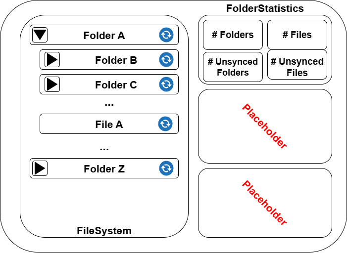

# Synchronization Frontend Page Documentation

This page provides an overview of the sections displayed on the Synchronization frontend page of the FileBridge application. The general layout is illustrated in the following diagram:

## Page Sections Overview

The Synchronization page consists of several main sections:

1. **Folder Tree View**
2. **Statistics/Info Panel**
3. **Historic Data**
4. **Tool Logs**

Each section is described in detail below, including the data displayed and its link to the internal data model.

---

## 1. Folder Tree View

**Displayed Data:**
- Hierarchical view of folders in the file system
- Expand/collapse functionality
- Selection state

**Data Model Link:**
- Maps to the `FileSystem`, `Folder` and `File` classes in the internal data model.
- Each folder node represents a `Folder` object, with children corresponding to subfolders.

---

## 2. Statistics/Info Panel

**Displayed Data:**
- Summary statistics (number of files, folders, total size, sync progress)
- Status messages and notifications

**Data Model Link:**
- Uses the `FolderStatistics` class and related aggregation logic from the internal data model.
- Sync progress and status are derived from the state of `File` and `Folder` objects.

---
