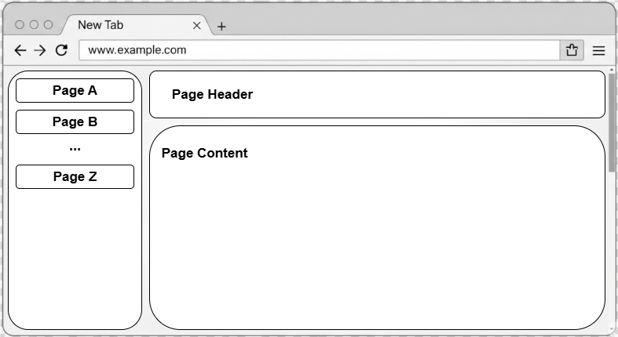

# Frontend Overview

This page provides a general description of the frontend structure of the FileBridge application. The layout and navigation are illustrated in the following diagram:

## Structure

The frontend consists of several main sections:
- **Navigation Bar**: Allows switching between main tabs (Synchronization, Configuration, Documentation).
- **Page Header**: Header of the currently displayed sub-page
- **Page Content Area**: Displays the selected tab's content, such as file system views, configuration forms, or documentation.

Refer to the diagram above for a visual representation of these sections.

## Sub-Pages

Below are links to detailed documentation for each main frontend section:

- [Synchronization](./001_synchronization/documentation.md)
- [Configuration](./002_configuration/documentation.md)
- [Documentation](./003_documentation/documentation.md)

Each sub-page provides further details and examples for its respective topic.
