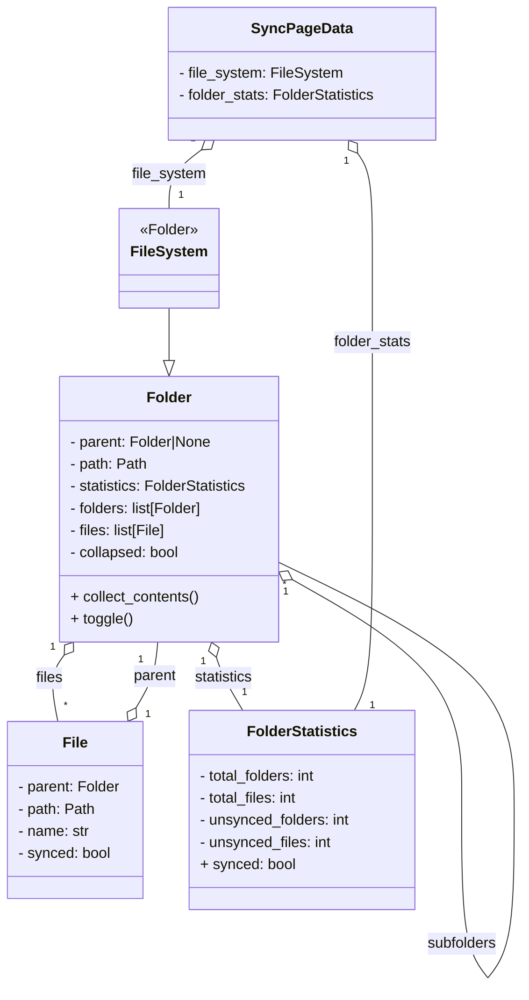

# Synchronization Page Data Model

## Overview

This chapter describes the data model used for the synchronization page. It covers the main classes, their attributes, and relationships, as implemented in `src/pages/synchronization/model/files.py` and `src/pages/synchronization/model/page.py`.

### Related Use Cases

The following use cases are implemented by this data model:

- [UC_FH_001: Data Structure for File System and Synchronization Status](../../../002_use_cases/002_file_handling/uc_fh_001.md)
- [UC_FH_002: Data Structure for Aggregated Synchronization Information](../../../002_use_cases/002_file_handling/uc_fh_002.md)

---

## What the Objects Can Do

- Traverse and represent the file system hierarchy.
- Aggregate and report synchronization statistics.
- Support UI state (collapsed/expanded).
- Enable configuration-driven initialization.

---

## Main Data Classes

### 1. `FileSystem`
- Represents the root of the file system tree.
- Inherits from `Folder`.
- Stores all folders and files under the given path.

### 2. `Folder`
- Represents a folder in the file system.
- Attributes:
	- `parent`: Reference to parent folder (or None for root).
	- `path`: Filesystem path.
	- `statistics`: Instance of `FolderStatistics`.
	- `folders`: List of subfolders.
	- `files`: List of files.
	- `collapsed`: UI state for display.
- Methods:
	- `collect_contents()`: Recursively collects files and folders, aggregates statistics.
	- `toggle()`: Toggles collapsed state.

### 3. `File`
- Represents a file in the file system.
- Attributes:
	- `parent`: Reference to parent folder.
	- `path`: Filesystem path.
	- `name`: File name.
	- `synced`: Boolean sync status.

### 4. `FolderStatistics`
- Stores aggregated statistics for a folder.
- Attributes:
	- `total_folders`: Total number of folders.
	- `total_files`: Total number of files.
	- `unsynced_folders`: Number of unsynced folders.
	- `unsynced_files`: Number of unsynced files.
- Property:
	- `synced`: Returns True if all folders and files are synced.

### 5. `SyncPageData`
- Loads configuration and initializes the file system.
- Attributes:
	- `file_system`: Instance of `FileSystem`.
	- `folder_stats`: Instance of `FolderStatistics` (from root).

---

## Mermaid Class Diagram

---

## Relationships

- `FileSystem` is the root folder, containing all other folders and files.
- Each `Folder` can have multiple subfolders and files, and holds aggregated statistics.
- Each `File` belongs to a `Folder`.
- `SyncPageData` loads the configuration and provides access to the root file system and its statistics.

---