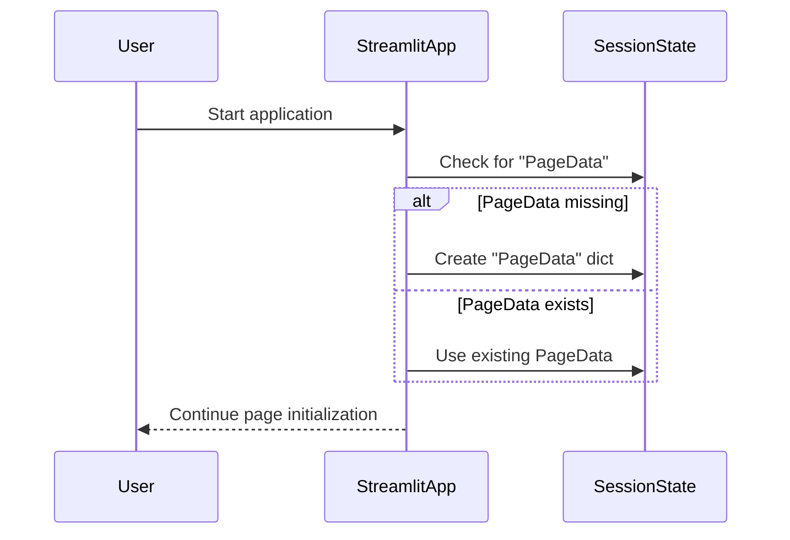
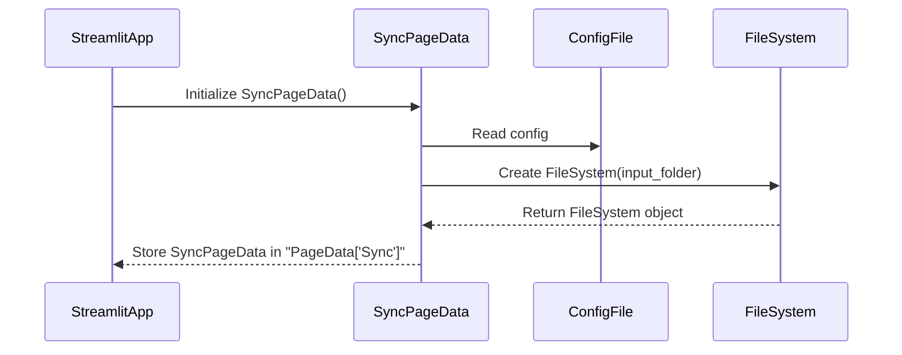

# Application Initialization

This chapter describes the general initialization flow for the application and the specific initialization logic for each page. Extend this structure as new pages are added.

---

## General Initialization

When the Streamlit app starts, it checks for the existence of the `"PageData"` key in `st.session_state`. If missing, it creates a new dictionary for `"PageData"` to hold page-specific data objects.

### General Initialization Flow

**Trigger:**
Occurs on application startup.

**Steps:**
1. The app checks for `"PageData"` in the session state.
2. If missing, it creates a new dictionary for `"PageData"`.

#### Sequence Diagram

---

## Synchronization Page

### Overview

Initialization for the synchronization page occurs after the general application initialization. The actual data model initialization is performed by the `SyncPageData` class in `src/pages/synchronization/model/page.py`.

### Initialization Flow

**Trigger:**
Occurs when the app initializes the synchronization page and `"PageData['Sync']"` is not present.

**Steps:**
1. The app initializes the `"Sync"` key with a new `SyncPageData` object.
2. `SyncPageData` loads configuration from frovided configuration file.
3. The input folder path is read from the config.
4. A `FileSystem` object is created for the input folder.
5. Aggregated folder statistics are calculated and stored.

#### Sequence Diagram

---
