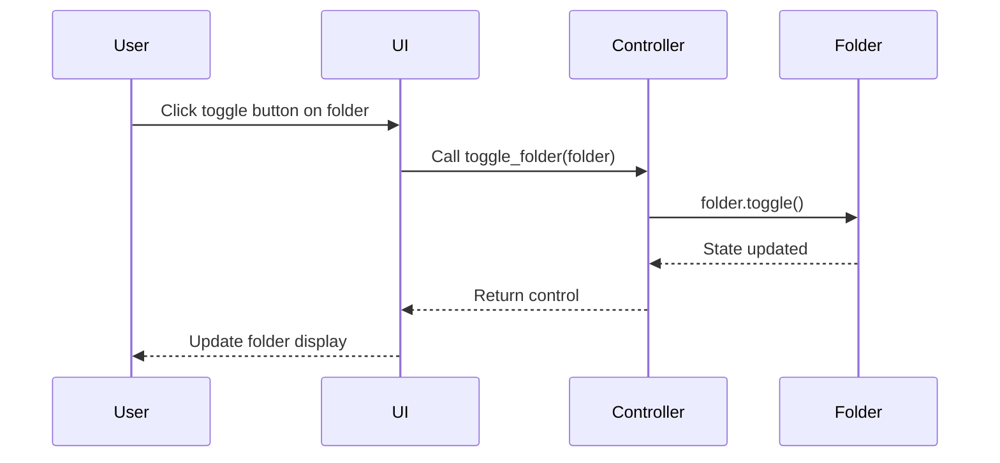

# Synchronization Page Control Flows

This chapter documents the control flows used in the synchronization page. Each section corresponds to a file in `src/pages/synchronization/controller`, describing the control flows implemented within and visualizing them using Mermaid sequence diagrams.

---

## file_system.py

### Overview

This file contains control flows related to folder operations in the synchronization page, specifically toggling the collapsed state of a folder.

### Control Flow: Toggle Folder

**Function:** `toggle_folder(folder: Folder) -> None`

**Related Use Case:**
- [UC_FE_001: Detailed File System Overview and Synchronization Status](../../../002_use_cases/001_frontend/uc_fe_001.md)

**Description:**
Toggles the collapsed/expanded state of a folder in the file system tree. This affects the UI display of the folder and its contents.

#### Sequence Diagram

---
